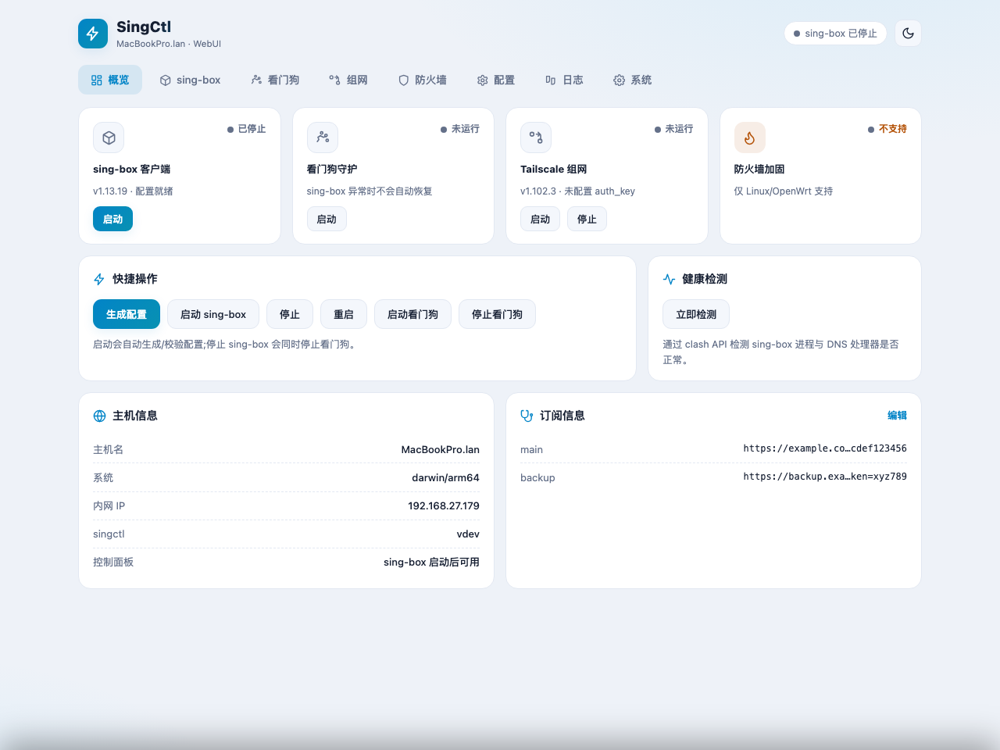
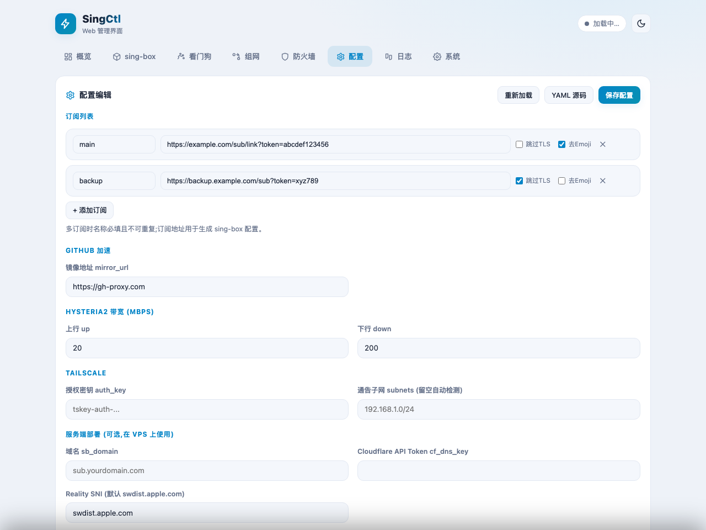

# WebUI 网页管理

`singctl web` 启动一个内嵌的 Web 管理界面,在浏览器中即可完成 singctl 的日常管理:
状态总览、sing-box 启停/更新、规则集缓存、看门狗守护、Tailscale 组网、防火墙加固、
配置编辑和日志查看。





## 特性

- **零依赖单文件**:前端资源全部内嵌在 singctl 二进制中,无需 Node.js/数据库,适合 OpenWrt 等嵌入式系统
- **非侵入设计**:所有操作通过调用 singctl 自身 CLI 完成,与命令行行为完全一致
- **实时输出**:操作输出流式回传到页面控制台,与终端体验一致
- **深色/浅色主题**:自动跟随系统,可手动切换
- **手机适配**:响应式布局,手机浏览器也能方便操作

## 快速开始

```bash
singctl web start              # 后台启动(推荐),监听 :8090
singctl web status             # 查看后台运行状态
singctl web stop               # 停止(简写 singctl w s)
singctl web                    # 前台运行(Ctrl+C 停止,适合调试)
singctl web start -l :8080 --password xxx   # 自定义端口 + 口令(admin/xxx)
```

后台模式的机制与看门狗一致:启动时原子抢占状态文件(`/tmp/singctl-web.pid`)防止并发启动,
fork 后等待子进程真正绑定端口成功才返回(失败如实报错);日志写入 `/tmp/singctl-web.log`。

启动后浏览器访问 `http://<路由器IP>:8090`。

## 参数

| 参数 | 环境变量 | 说明 |
| :--- | :--- | :--- |
| `-l, --listen` | - | 监听地址,默认 `:8090`
| `-p, --password` | `SINGCTL_WEB_PASSWORD` | 访问口令(用户名固定 `admin`,留空则不鉴权) |

子命令:`start`(后台启动)、`stop`(停止,别名 `s`)、`status`(状态,别名 `st`);
不带子命令时为前台运行。

> ⚠️ **安全提示**:不设口令时任何能访问该端口的人都可以管理你的路由器,
> 请确保仅暴露在可信内网;如需从公网访问,务必设置口令。

## OpenWrt 开机自启(推荐)

内置的 `web start` 不会开机自启、崩溃也不会重生;生产环境建议用 procd 托管:

创建 `/etc/init.d/singctl-web`:

```sh
#!/bin/sh /etc/rc.common

START=99
STOP=10

USE_PROCD=1

start_service() {
    procd_open_instance
    procd_set_param command /usr/bin/singctl web --listen :8090
    # 如需口令,可改为:
    # procd_set_param command /usr/bin/singctl web --listen :8090 --password 你的口令
    procd_set_param respawn 3600 5 0
    procd_set_param stdout 1
    procd_set_param stderr 1
    procd_close_instance
}
```

启用:

```sh
chmod +x /etc/init.d/singctl-web
/etc/init.d/singctl-web enable
/etc/init.d/singctl-web start
```

## 页面说明

| 页面 | 功能 |
| :--- | :--- |
| **概览** | sing-box / 看门狗 / Tailscale / 防火墙状态卡片,快捷操作,健康检测,主机与订阅信息 |
| **sing-box** | 启动/停止/重启/生成配置,安装/更新,规则集缓存状态与管理 |
| **看门狗** | 守护进程启停、重启统计、日志路径 |
| **组网** | Tailscale 模式选择(路由器/出口节点/网关)、启停、安装更新 |
| **防火墙** | 安全封锁规则启用/禁用 |
| **配置** | 订阅、镜像、Hysteria2 带宽、Tailscale、服务端配置的表单编辑;也可直接编辑 YAML 源码 |
| **日志** | 守护进程日志 / 看门狗日志查看,支持自动刷新 |
| **系统** | 版本信息、singctl 自更新、带宽测速 |

### 健康检测

通过 sing-box 的 clash API(`/dns/query`)直接测试 DNS 处理器是否正常,
不经过任何防火墙规则,与看门狗的判定逻辑一致。检测最长约 20 秒。

### 配置编辑说明

- 表单保存前会自动备份到 `<配置路径>.webui-bak-<时间戳>`(保留最近 3 份)
- 表单保存会重写 YAML,**注释会丢失**;需要保留注释请使用「YAML 源码」模式
- 保存配置不会重启 sing-box,需要重启才能让新配置生效

## API

WebUI 后端提供简洁的 REST API,可用于自动化:

| 方法 | 路径 | 说明 |
| :--- | :--- | :--- |
| GET | `/api/status` | 全量状态(sing-box/看门狗/组网/防火墙/主机/订阅摘要) |
| GET | `/api/health` | 健康检测(进程 + DNS,最长约 20s) |
| GET/PUT | `/api/config` | 配置读取/保存(JSON) |
| GET/PUT | `/api/config/raw` | 配置原文读取/保存(YAML) |
| GET | `/api/cache` | 规则集缓存状态 |
| GET | `/api/logs?name=daemon\|watchdog&tail=200` | 日志尾部 |
| POST | `/api/action` | 执行动作(NDJSON 流式返回) |

动作示例:

```bash
curl -N -X POST http://127.0.0.1:8090/api/action \
  -H 'Content-Type: application/json' \
  -d '{"name":"sb-start"}'
```

可用动作:`sb-start/stop/restart/gen/install/update`、`cache-update/clear`、
`dm-start/stop`、`ts-start/stop/install/update`(ts-start 支持
`{"params":{"mode":"router","acceptRoutes":true}}`)、`fw-enable/disable`、
`update-self`、`speedtest`。

另有 clash API 反向代理:`/clash/*`(面板与 API)及 `/connections`、`/proxies` 等 clash API 根路径直通(供内嵌面板的页面同源请求使用)。

同一时刻仅允许一个动作执行,并发请求返回 `409`。
